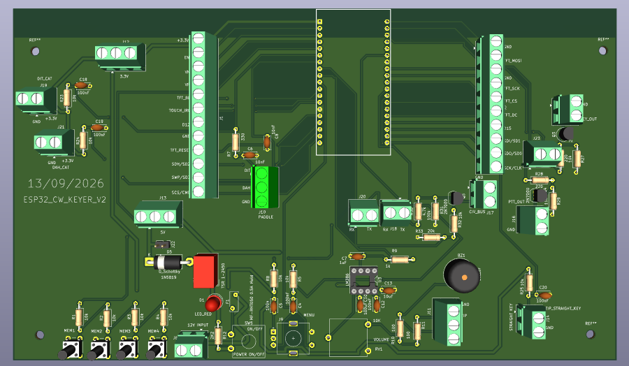
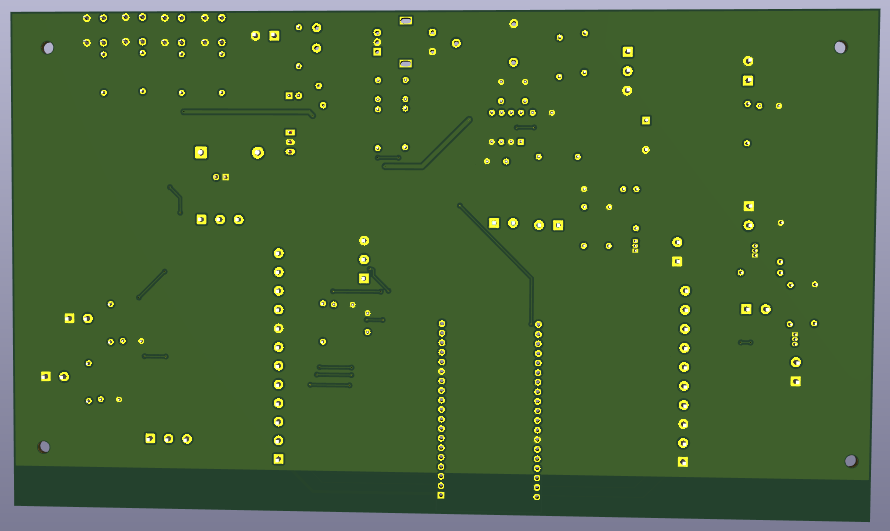

# ESP32 CW Keyer

Open-source ESP32 CW keyer and Morse trainer designed by **ON2DK**.

This is the extended version of the stand-alone Morse Trainer project. It uses a **38-pin ESP32 DevKit with ESP32-WROOM-32D** and adds radio-interface functions for CAT, CW KEY and PTT together with four memory/program buttons.

## Main features

- ESP32-WROOM-32D DevKit, 38-pin version
- ST7789 240x320 SPI TFT support
- Paddle input
- Straight-key input
- Rotary encoder with push switch for menu/settings
- Four memory/program buttons on one ADC input
- Audio/sidetone section with LM386 and buzzer
- Universal CAT connection
- On-board Icom CI-V interface
- CW KEY output
- PTT output
- Separate 12 V DC input
- TSR 1-2450 12 V to 5 V DC/DC converter
- POWER LED on the switched 12 V supply
- USB on the ESP32 DevKit for programming
- Predominantly through-hole construction

## PCB status

The hardware design has been completed and checked in KiCad. The final V2 board is a 2-layer FR-4 PCB with four M3 mounting holes. Final KiCad checks reported:

- 0 DRC violations
- 0 unconnected items
- 0 schematic/PCB parity errors

The final PCB outline is approximately **227.75 x 132.86 mm**.

## Repository structure

- `KiCad/` - editable KiCad source archive and project notes
- `Gerber/` - production Gerber and drill archive
- `Firmware/` - Arduino IDE firmware and firmware notes
- `Enclosure/` - 3D-printable enclosure files and OpenSCAD sources
- `Documentation/` - project logbook, BOM and CAT guide
- `Images/` - PCB and project images

## Production files

The current source packages are available here:

- `KiCad/ESP32_CW_KEYER_V2_KiCad_Source.zip`
- `Gerber/ESP32_CW_KEYER_V2_Gerber.zip`

Before PCB production, open the Gerbers in a Gerber viewer and verify copper, solder mask, silkscreen, Edge.Cuts and drill files.

## Firmware

The V2 Arduino IDE firmware is available as:

- `Firmware/ESP32_CW_KEYER_V2.ino`

The firmware uses the final V2 PCB GPIO mapping and includes the ST7789 TFT, rotary encoder, paddle and straight-key operation, sidetone, four memory buttons, KEY/PTT control and CAT UART support.

The current firmware was successfully **compiled/verified in Arduino IDE on 13 September 2026** with **ESP32 Dev Module** selected. The compile used approximately **351815 bytes (26%)** of program storage and **24480 bytes (7%)** of dynamic memory.

**Important:** successful compilation does not replace hardware testing. The firmware is the first V2 hardware-matched baseline and still requires testing on the assembled PCB. In particular, the four memory-button ADC values must be calibrated on the actual hardware and CAT settings must be matched to the connected transceiver.

## CAT and radio interfaces

The universal CAT connection exposes the ESP32 CAT UART as **3.3 V logic**:

- GND
- CAT_TX
- CAT_RX
- +5 V for powering an external active adapter when required

**The CAT_TX and CAT_RX signals are 3.3 V UART and are NOT RS-232 levels.** Do not connect them directly to a radio connector that expects true RS-232 voltage levels. Use the appropriate active level-converter/adapter for the specific transceiver.

The PCB also includes a dedicated single-wire **Icom CI-V** interface. Radio compatibility, connector pinout, baud rate and electrical levels must always be checked for the exact transceiver model before connection.

CW KEY and PTT are provided separately through the MOSFET interface section.

## Power and programming

Normal operation uses the separate **12 V DC input**. The ESP32 DevKit USB connector is intended for programming. During USB programming, the external 12 V supply should be switched off.

## Radio interface caution

Before connecting a transceiver, first verify the power rails and test CAT, KEY and PTT separately.

The board uses **2N7000 MOSFETs** in the radio-interface section. Check the exact transistor datasheet before soldering. The PCB design expects the electrical pin mapping **1 = Source, 2 = Gate, 3 = Drain**; not every manufacturer/package orientation is necessarily identical.

## Enclosure

The `Enclosure/` folder contains the OpenSCAD source and printable STL parts for the V2 enclosure, including front panel, rear panel, bottom and lid.

The enclosure source is:

- `Enclosure/ESP32_CW_KEYER_V2_Kast.scad`

The TFT window in the current enclosure design should be checked against the exact physical TFT module before final printing.

## Documentation

The detailed project logbook, BOM and CAT information are available in:

- `Documentation/ESP32_CW_KEYER_V2_Projectlogboek_DEFINITIEF_MET_BOM_CAT_GUIDE.docx`

## Important build note

Always compare the physical pinout and dimensions of purchased components with the KiCad footprints before soldering. Pay particular attention to polarized parts, connector orientation, transistor pinouts and the ESP32 antenna keep-out area.

## Project status

- Hardware design: complete
- KiCad checks: passed
- Gerber production files: prepared
- Enclosure: available; final TFT fit to be verified
- Documentation/BOM: available
- V2 firmware: compiles successfully; hardware testing pending

This project is still subject to practical verification on the assembled PCB before being considered fully hardware-tested.
